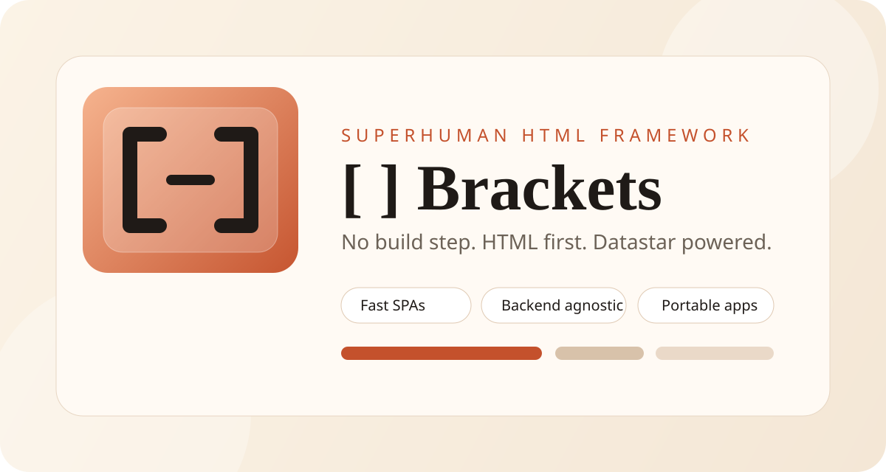

# Brackets Docs

Brackets is a no-build, HTML-first, Datastar-powered framework for fast SPAs, websites, apps, and desktop-style experiences.

Use this page as the public documentation front door on GitHub. The **`*.md` files here are the full narrative** (for browsing in-repo or on github.com); the **`*.html`** files on GitHub Pages are shorter curated pages that mirror the same model.

Current status:

- `v0.95`
- syntax locked
- Datastar underneath
- ready for broader production-style evaluation

## Getting started

**Orientation:** **[Guide](./guide.md)** covers practical patterns; **[Reference](./reference.md)** is the language contract. Everything here matches **`framework/agents.md`** and the runtime shipped under **`framework/`**.

**Package entry:** root [`index.html`](../index.html) is the bootstrap shell only (import map, `import "brackets"`, `#app-root`). Routes and templates belong under **`app/`**, not in `index.html`.

**Copy-paste templates:** **[Framework example package](./guide.md#framework-example-package)** (`framework/example/`). The runnable demo lives under **`framework/demo/`**.

### Dynamic app, static shape

The framework keeps a **stable file layout** while the UI and data stay dynamic: `.view` / `.html` for UI, `.logic` for behavior, `.data` for local rules, `.api` for remote authority. See [Modern flat-file app model](./guide.md#modern-flat-file-app-model).

### Simple website

Use `.view` routes, `.html` templates, and optional SEO fields on the manifest. See [Guide: website and SEO patterns](./guide.md#website-and-seo-patterns).

### SPA

Brackets supports file-based routes, layouts, and Datastar-driven UI updates. See [Guide: building common app types](./guide.md#building-common-app-types).

### Backend-connected app

Use `.api` for HTTP/SSE to your backend; keep the Brackets file model on the frontend. See [Guide: remote API patterns](./guide.md#remote-api-patterns).

### Local-first app

Put model and persistence rules in `.data` and local storage under the host contract. See [Guide: local data patterns](./guide.md#local-data-patterns).

### Docker setup

See **[docker.md](./docker.md)**.

### Production setup

See **[platform.md](./platform.md)**, **[release.md](./release.md)**, and **[docker.md#production-docker-shape](./docker.md#production-docker-shape)**.

## Start Here

- [Getting started](#getting-started)
- [Guide](./guide.md) — includes [Framework example package](./guide.md#framework-example-package) (`framework/example/`)
- [Reference](./reference.md)
- [Agents](./agents.md)

## Best Learning Path

If you want the smoothest path in:

1. [Getting started](#getting-started)
2. [Guide](./guide.md)
3. Run `config show` and `info`
4. Run `health` and `test app`
5. [Reference](./reference.md)

## Learn The Model

If you want to understand how Brackets is meant to work before you build:

- [Dynamic app, static shape](#dynamic-app-static-shape)
- [Modern flat-file app model](./guide.md#modern-flat-file-app-model)
- [Platform contracts](./platform.md)

## Why Brackets

- No build step.
- HTML stays the main template surface.
- Datastar stays the engine.
- Brackets adds routing, layouts, lifecycle, app structure, and portable hosting.
- The same app model can work with local files, SQLite, C#, Tauri, .NET, Go, Rust, Python, PHP, Ruby, Java, Node, and other backends.

## Learn By Goal

### Build a simple website

- [Getting started](#simple-website)
- [Guide: website patterns](./guide.md#website-and-seo-patterns)

### Build a fast SPA

- [Getting started](#spa)
- [Guide: SPA](./guide.md#building-common-app-types)
- [Guide: async and data patterns](./guide.md#async-and-data-patterns)

### Connect any backend

- [Getting started](#backend-connected-app)
- [Guide: remote API patterns](./guide.md#remote-api-patterns)
- [Reference: `.api` helper surface](./reference.md#api-helper-surface)

### Build local-first with files or SQLite

- [Getting started](#local-first-app)
- [Guide: local data patterns](./guide.md#local-data-patterns)
- [Reference: storage guidance](./reference.md#storage-guidance)

### Understand the modern architecture

- [Getting started: dynamic app, static shape](#dynamic-app-static-shape)
- [Guide: modern flat-file app model](./guide.md#modern-flat-file-app-model)
- [Platform: local data and authority profiles](./platform.md#4-local-data-contract)

### Ship to production

- [Docker](./docker.md)
- [Platform](./platform.md)
- [Release](./release.md)

## Core Concepts

### File model

- `.view`
- `.logic`
- `.api`
- `.data`
- `.html`
- `.json`
- `.yaml`
- `.db`

### Runtime model

- `page(...)`
- `mount(ctx)`
- `sync(ctx)`
- `run(payload, ctx)`
- named actions
- grouped `ctx`

### Syntax

- `[name]`
- `#name`
- `@event="..."`
- `:state`
- `:calc`
- `:text`
- `:show`
- `:bind`
- `:if`
- `:each`
- `:use`
- `:props`
- `:mount`
- `mutate()`
- `read()`
- `request()`
- `get()`
- `create()`
- `update()`
- `patch()`
- `delete()`

## Documentation Map

- [Getting started](#getting-started)
- [Guide](./guide.md)
- [Framework example package](./guide.md#framework-example-package) — copy-paste templates in [`framework/example/`](../framework/example/)
- [Reference](./reference.md)
- [Checklist](./checklist.md)
- [Platform](./platform.md)
- [Docker](./docker.md)
- [Release](./release.md)
- [Agents](./agents.md)
